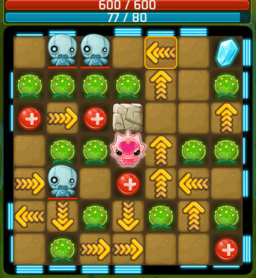

# Alien-vs-Zombie



Zombies are coming for you, the world is at war, Alien must fight!<br>
Alien-vs-Zombie combines Puzzle, Path-Planing and strategy for an out-of-this-world gaming experince.Players must eliminate enimies by cleverly navigating the aliens on a path to destroy the invading zombie.Each move counts, so set a path and pave your way to destroy zombies.Only a well-planned out strategy will see the survival of Alien .

Features:<br><br>
 -Mind Blowing Strategy:<br><br>
  Get a diresct strike at Zombies by planing a combo attack with changing the arrow object direction before navidating the Alien.<br><br>
 -Distinctive zombies to fight making the game easy but challengeing:<br><br>
  Number of zombies increases the dificulty level of the game as the zombie have witdh range of attack.<br><br>
  
 YouTube link to [Video Demo](https://youtube.com).

## Compilation Instructions

Provide instructions on how to compile your program, especially when it is non-trivial.

For example:

```
cmd
mingw32-make all
alienvszombie.exe
```

## User Manual
Character: Alien, and zombie

Alien: Player control Alien
Zombie: Computer generator 


Overview
"Alien vs Zombie" is played on a grid of characters. Players can input commands to move the alien around the grid and interact with the zombies. The player controls alien to defeat all the Zombies only with close range. 

Prior to the game, the player can customize settings including game board dimensions and number of zombies to increase difficulties. Life and attack values of the alien and zombies is always displayed.The player can also save a game into a file and load a game from a file.

Command-Player plays the game by typing commands.

1. Up '^'
Alien to move up. 

2. down 'v'
Alien to move down.
 
3. left '<'
Alien to move left. 

4. right '>'
Alien to move right. 

5. arrow 
Changes Alien's direction of movement with an arrow object in the game board. User will need to enter the row and column of the arrow object to switch, followed by the direction of the arrow object to switch to.

6. help 
Display the commands that the player can use in the game. 

7. save 
Save the current game to a file. (The player will be asked to enter the name of the file to save to). 

8. load 
Load a saved game from a file (The player will be asked to enter the name of the file to load from). 

9. quit 
Quit the game while still in play. 

Game Objects

1. Health pack 'h'
Adds 20 life to Alien (if life not full)

2. Pod 'p' 
Instantly inflicts 10 damage to Zombie when hit by Alien

3. Rock 'r' 
Hides a game object (except Rock and Trail) beneath it. 
Reveals the hidden game object when hit by Alien. 
Stops the Alien from moving. 

4. Empty Space ' '
Just an empty space on the board. 

5. Trail '.'
Left by Alien when it moves.
Reset to a random game object (except the Trail) after Alien’s turn ends.

## Progress Log

- [Part 1](PART1.md)
- [Part 2](PART2.md)

## Contributors

Please replace the following with your group members' names. 

- LOI XINYI 
- LAM YUET XIN
- MISCHELLE THANUSHA A P JULIUS
